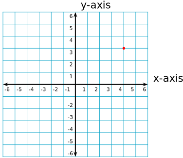
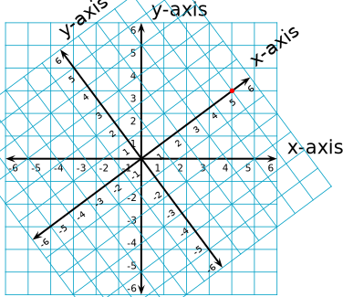
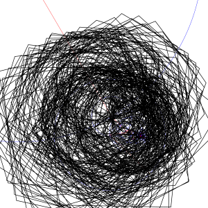
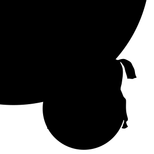

# fourier-polygon

(C) 2018 Andrew Pritchard (MIT License)

Draws an arbitrary polygon based on tracing the paths of rotating circles.

## Usage

### Invocation

```javascript
var div = document.getElementById ("app");
var path = [
    [0, 0], [0, 25], [0, 50], [0, 75], [0, 100], [25, 100], [50, 100],
    [75, 100], [100, 100], [100, 75], [100, 50], [100, 25], [100, 0], [75, 0], 
    [50, 0], [25, 0]
];
var timePerPoint = 200 // milliseconds

var diagram = new FourierDiagram (div, path, timePerPoint);

diagram.draw(); // draws a square.
```

### Parameters

* `div`: The area in the page where you want the diagram to draw to.
* `path`: a series of points you want the algorithm to trace through. Each point should be an array with two elements, the zeroth element is the x coordinate and the first element is the y coordinate. A higher x coordinate is further to the right, and a higher y coordinate is further downwards. A path is an array of points.
* `timePerPoint`: the interval in milliseconds between one point and the next. The total time it takes to draw the diagram will be `timePerPoint * path.length`.

### Description

The `FourierDiagram` object will produce an animation which will trace `path` using only circles rotating at a constant speed. The diagram will automatically resize based upon the points given in `path`. The traced line from the circles generated by `FourierDiagram` will *always* pass through every point that you supply in `path`, but there is no guarantee that between points there will be anything close to a straight line. With certain sets of points, there may be a significant "wobble".

`FourierDiagram` works best when the points are evenly spaced and lack sharp turns. If you add a single outlying point to an otherwise smooth curve, the result will be significantly perturbed (See the "square with outlying point" in the demo).

## Fundamental basis

Joseph Fourier was a French mathematician and physicist who created a solution to a problem in physics relating to the way that heat spreads. Solutions existed when the source of heat was a sine or cosine wave, so Fourier described a way in which a complicated source of heat could be modeled as the sum of sine and cosine waves to produce a solution. Fourier was never concerned about signals analysis, but his work resulted in the Fourier transform.

Transforms in mathematics allow us to describe points in different coordinate systems. For example, we can model a point in 2D space as it's position along an x and y axis (Cartesian coordinates), and we could transform that point so we could describe it as the distance from the origin, and an angle (polar coordinates). We will consider the transformation that occurs when we rotate the x and y axis, but leave a point stationary.

Let's say we have the point `(4, 3)` in Cartesian coordinates. We want to keep the point in the same place, but we want to change how our x and y axis are orientated:



This image shows point `(4, 3)` now let's rotate the axis and see what our new coordinates are:



Point (4, 3) now appears at coordinate (5, 0). Since we have not changed where the point lies, but only the rotation of the axes, we can reverse this transformation to get our original coordinate. Any point we describe in the plane can be transformed this way and then transformed back. This can be done for as many dimensions as required, and can even be done (with some limitation) in **Hilbert space** (infinite dimensions). This rotation of the axes is called a **change of basis**.

Fourier discovered that it was possible to trace the path that a rotating circle makes in the complex plane, and make that path into a vector of complex numbers. If you compared the vectors that two different rotating circles would make at different speeds, you would find that they would be perpendicular, just like the x and y axes are perpendicular. Fourier discovered that if you rotated the coordinate system so that the new x and y axes were in the direction of various rotating circles, you could decompose a vector into a series of rotating circles.

Unfortunately real computers don't have infinite anything, so we cannot calculate the transform of an infinitely dimensioned point nor it's reverse. The original Fourier transform is a change of basis in Hilbert space and decomposes a continuous signal into the sum of infinitely many rotating circles. Thus the **Discrete Fourier Transform** was invented. This allows us to convert a complex vector of finite dimensions, into a series of finite rotating circles. This is how we create the diagrams in this demo.

## About the library

The path data is, to normal users, a series of points in two dimensions, and tells us the various coordinates in a long line. It is not a large stretch of the imagination to instead view them as a series of complex numbers, where the real part is the x coordinate, and the imaginary part, the y coordinate. It is perhaps a bigger stretch to view the path data as an `N` dimensional vector, where `N` is the number of points in the path. So instead of representing a series of points in 2 dimensional space, it represents a single point in N dimensional space, where each value is itself 2 dimensional.

The DFT allows us to rotate the coordinate system so that we can view the path data as the sum of a series of complex vectors which represent the path a circle traces in two dimensions. Since we lose no information in a rotation, this rotation is exact, and reversible. This means that in the digram, the path traced by all of the circles added together will pass through *every point you specify no matter how outrageous!*. This property is guaranteed, however, there is no guarantee what the rotating circles will do *between* points. Outrageous points invariably lead to equally outrageous transforms.

If it takes one minute to draw the path from start to finish, then the zeroth axis of the DFT will represent a circle which does not turn at all. The first axis will represent a circle which turns once per minute, the second axis represents a circle that turns twice per minute and so on. This leads to the last circle turning extremely quickly, and while the line it traces will pass through every point you specify, the shape of whatever it is you were trying to approximate will be lost in a pointless series of scribbles:



If you have a very large imagination and squint, you still can't make out the horse.

The following lines of code are very important:

```javascript
if (i === nyquist) {
    k -= N;
}
```

With the discrete fourier transform, all frequencies `mod (N)` where `N` is the number of points in the path are **aliased**. This means that if it takes a minute to draw your diagram, which has 200 points, a circle rotating at 215 rotations per minute will be equivalent to a circle rotating at 15 revolutions per minute, or one rotating at 185 rotations per minute *in the other direction*. This means the fast moving circles near the end can be reigned in.



Much better.

Note that obviously, they are not the same, the second path drawn is far more stable than the first which is an absolute mess. However, they are equivalent in the regard that if you consider each point a "checkpoint" which the transform has to pass through at a certain time, then both versions (however unlikely it may seem) pass through each "checkpoint" at exactly the same time.

## About the implementation

I would have preferred to be able to simply create the animated SVG without any JavaScript controlled animations, however, it seems that if you nest svg groups anything more than 40 or so deep, some of the paths lower down will not render, making it a bit pointless. It was required to use JavaScript for the animations, that way, I can keep everything as a child of the top level SVG.

I just use a regular DFT rather than an FFT since this is not really a bottleneck anyway.

Well hope you enjoy this silly little demo!
